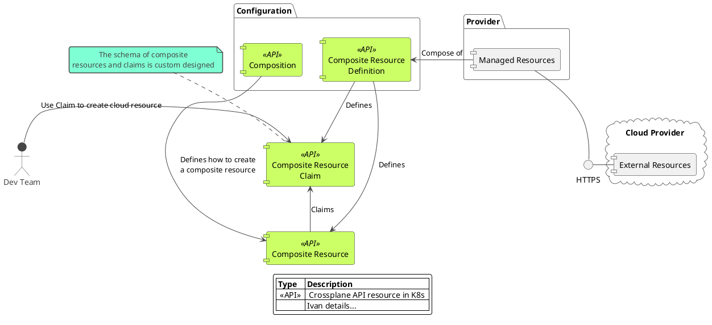

# Crossplane POC

## Introduction Presentation

[Crossplane Slides](https://slides.com/decoder/crossplane)

## Crossplane Components

Below diagram shows crossplane component model and its basic intetactions.



## Demo Scenario

### Prerequisites

To follow along, you will need subscription to AWS and CLI configured on your local machine.

Credenials for accessing cloud enviroments and deploying the infrastructure will be mapped from mouonted volumes.

Locally installed you will need:

- VS Code with remote contianers devcontainer plugin
- WSL2 if using Windows

### Scenario Description

The demo scenario highlights Crossplane's composite functionality. Using composites helps abstract away infrastructure complexity from developers by moving it into a Platform Team.

The scenario flow:

- install crossplane on a local cluster :white_check_mark:
- deploy and configure AWS provider :white_check_mark:
- expose composites to the developers
- developers deploy and manage the life-cycle of dev/test clusters in AZURE and AWS
- manage composites lifecycle

### Demo Setup

All components from the [crossplane installation](https://crossplane.io/docs/v1.5/getting-started/install-configure.html#install-crossplane) are already pre-installed in the devcontainer in this project.

The components are:

- Kubernetes minikube
- Helm
- kubectl
- Crossplane CLI
- AWS CLI

> Crossplane should be installed in a _crossplane-system_ namespace, if not please run `.devcontainer/library-scripts/setup-crossplane.sh`

#### AWS provider

The setup will automatically generate AWS configuration based on the default profile mounted from your local $HOME/.aws folder.

> creds.conf file is added to .gitignore so you will not commit it to the repo accidentally!

Next step is to configure Crossplane to access AWS and create resources, we will achieve this by creating a secret:

`kubectl create secret generic aws-creds -n crossplane-system --from-file=creds=./creds.conf`

and now, install AWS provider on the cluster `kubectl apply -f https://raw.githubusercontent.com/crossplane/crossplane/release-1.5/docs/snippets/configure/aws/providerconfig.yaml`

From there onwards you should be able to follow along with the demo from Crossplane's web page.

### Deploy RDS Instance

### Deploy EKS Cluster

#### Retrieve kubeconfig details

```bash
kubectl get secrets --namespace devops-team cluster \
     --output jsonpath="{.data.kubeconfig}" \
     | base64 --decode | tee eks-config.yaml

export KUBECONFIG=$PWD/eks-config.yaml
```

Remember to `unset KUBECONFIG` to get your old config back

## Conclusion

## TODO

- [ ] Should be moved to Infrastructure sub group once it's created.
