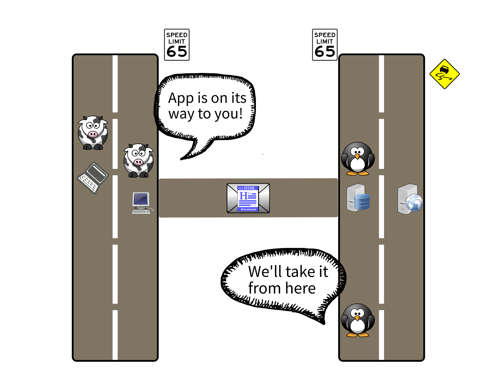
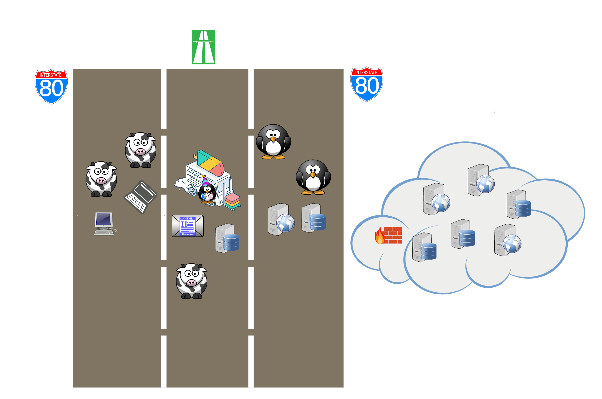
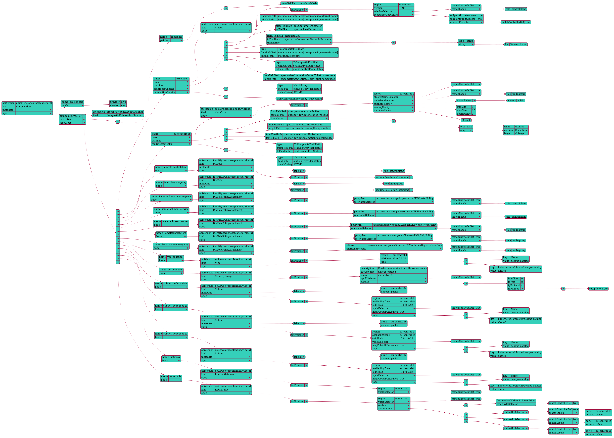
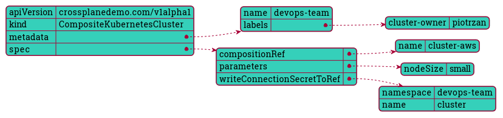

# Infrastructure as Code: the next big shift is here

This content is published as blogs on

- medium: [friend link](https://itnext.io/infrastructure-as-code-the-next-big-shift-is-here-9215f0bda7ce?source=friends_link&sk=9917683d7111c484a0ab6abda59fd3e4), so no paywall :)
- [Hackernoon](https://hackernoon.com/infrastructure-as-code-the-next-big-shift-is-here), they've introduced a pretty neat reading feature if you prefer to listen rather than read

## Introduction

In this blog, we will look at the evolution of software infrastructure; provisioning, delivery and maintenance.

If you are interested in modern DevOps and SRE practices, this article is for you.

**Infrastructure as Code (IaC)** is a common pattern where virtualized infrastructure and auxiliary services can be managed using configuration expressed in almost any language, usually hosted in a source code repository.

Every once in a while software industry is shaped by significant events called [Paradigm Shift](https://en.wikipedia.org/wiki/Paradigm_shift). Here are a few such events that made Infrastructure as Code what it is today:

- Virtualization
- Containerisation and containers orchestration
- Public Cloud Infrastructure
- DevOps Culture

### Infrastructure provisioning: evolution

Let’s examine how each wave of changes shaped the software landscape:

**#1 Virtualization**

In the early days of virtualization, developers would produce software in long waterfall development cycles, mostly based on requirements documentation. Ops Teams at the same time would rack and stack servers, provision infrastructure components, install all the things, configure etc. Typically both teams would work in a disconnected fashion, opening tickets and communicating via long email chains. Those were the darg ages.


**#2 Agile and beginning of DevOps**

Next came the agile revolution and with it the beginning of the DevOps culture. Now developers would send the application over to the Ops Team along with a multi-page configuration manual. More progressive teams will start collaborating on automation tools. In the early days of infrastructure automation tools like Chef or Puppet were very popular. Huge improvement, but often very siloed environment and fragmented responsibilities.



**#3 Public Cloud & container orchestration**

Along with increased usage of the public cloud and more robust automation, things started to fall into the right places. The tool of choice for most of the OPS Teams was terraform. Compared to the situation from a few years ago, this is huge progress. The amount of infrastructure created grows exponentially.

For a long time, this picture is almost perfect… almost. So what is missing? Well, the experience for both Dev and Ops falls a bit short. Meticulously created infrastructure starts to drift, requires a lot of effort and maintenance overhead. Developers on the other hand must learn new languages and struggle to incorporate the Ops tooling into their workflows. Community rallies around and comes up with all kinds of creative solutions, drift detection, more automation, observability etc. All those tools and projects are great, but not standardised.

How to improve the already good process? How to make one more leap to make something good, great? The answer came, like most good answers, from within the community itself. Remember how we talked about paradigm shifts? One of them was containerization and containers orchestration, this enabled standardization of to lesser extent packaging (container images) and runtime (Kubernetes pods) concerns. Now we have all the standards and tools at our fingertips, just one final touch needed to make it work seamlessly together. Here is how, in my opinion, [Crossplane](https://crossplane.io/) is the missing link in the infrastructure as code evolution.

> _The power of Crossplane comes from using cloud native open standards and most popular tools to enable Developers (aka Application Teams) and Ops (aka Platform Teams) to work together, but without depending on each other._



_Before we move on to the next part of the blog, a little disclaimer. Choosing cows and penguins to represent developers and ops respectively, was based purely on the cuteness level of the animal._

## Crossplane Architecture

What makes Crossplane so special? First, it builds on Kubernetes and capitalizes on the fact that the real power of Kubernetes is its powerful API model and control plane logic (control loops). It also moves away from Infrastructure as Code to Infrastructure as Data. The difference is that IaC means writing code to describe how the provisioning should happen, whereas IaD means writing pure data files (in the case of Kubernetes YAML) and submitting them to the control component (in the case of Kubernetes an operator) to encapsulate and execute the provisioning logic.

For me, the best part about Crossplane is that it seamlessly enables collaboration between Application Teams and Platform Teams, by leveraging [Kubernetes Control](https://containerjournal.com/kubeconcnc/kubernetes-true-superpower-is-its-control-plane/) Plane as the convergence point where everyone meets.

### Components

Let’s look how the Crossplane component model looks like. A word of warning, if you are new to Kubernetes this might be overwhelming, but there is value in making an effort to understand it. The below diagram shows the Crossplane component model and its basic interactions.


Source: Author based on Crossplane.io

## Demo Scenario

The demo scenario highlights Crossplane’s composite functionality. Using composites helps abstract away infrastructure complexity from developers by moving it into a Platform Team.

The scenario flow:

- deploy RDS
- deploy EKS
- highlight the main steps of creating and using a composition

### Prerequisites

To follow along, you will need subscription to AWS and CLI configured on your local machine.

Credenials for accessing cloud enviroments and deploying the infrastructure will be mapped from mouonted volumes.

Locally installed you will need:

- VS Code with remote contianers devcontainer plugin
- WSL2 if using Windows

### Demo Setup

All components from the [crossplane installation](https://crossplane.io/docs/v1.5/getting-started/install-configure.html#install-crossplane) are already pre-installed in the devcontainer in this project.

The components are:

- Kubernetes minikube
- Helm
- kubectl
- Crossplane CLI
- AWS CLI

> Crossplane should be installed in a _crossplane-system_ namespace, if not please run `.devcontainer/library-scripts/setup-crossplane.sh`

_This setup is a little bit clunky, for example, performance is sub-optimal due to files being read from the container and the overall setup is not where I want it to be. This might change into a vagrant based setup if the containers reach the limit of abuse._

#### Observability

To visualize CRDs use [Octant](https://docs.vmware.com/en/VMware-vSphere/7.0/vmware-vsphere-with-tanzu/GUID-1AEDB285-C965-473F-8C91-75724200D444.html); a VMWare open source cluster visualizer, running in a browser so no in-cluster installation is required.

If you like terminal tools more, [k9s](https://k9scli.io/) got you covered.

#### AWS provider

The setup will automatically generate AWS configuration based on the default profile mounted from your local $HOME/.aws folder.

> creds.conf file is added to .gitignore so you will not commit it to the repo accidentally!

Next step is to configure Crossplane to access AWS and create resources, we will achieve this by creating a secret:

`kubectl create secret generic aws-creds -n crossplane-system --from-file=creds=./creds.conf`

and now, install AWS provider on the cluster `kubectl apply -f https://raw.githubusercontent.com/crossplane/crossplane/release-1.5/docs/snippets/configure/aws/providerconfig.yaml`

From there onwards you should be able to follow along with the demos from [Crossplane's web page](https://crossplane.io/docs/v1.5/getting-started/provision-infrastructure.html).

### Deploy RDS Instance

First let's deploy an RDS Instance, which is an AWS managed resource and comes with the AWS provider.
See [crossplane components diagram](#crossplane-components).

`kubectl create -f rds-instance.yaml`

RDSInstance is just a Kubernetes resource like pod, service or replicaSet. You can check the deployment progress in Octant or command line: `watch kubectl get RDSInstance`

Delete the instance with `kubectl delete -f rds-instance.yaml`

### Deploy EKS Cluster

Deploying EKS cluster with automation is not a trivial task, there are are lot of components that need to be created along, like VPCs, subnets, IAM Roles, node pools, route tables, gateways...
This is not the experience developers want, but this complexity must go somewhere, there is no magic "Remove complexity" button!

As we've seen in the component diagram, the process starts with building an XRD (Composite Resource Definition) where we can specify:

- schema of the XR (Composite Resource)
- schema of the XRC (Composite Resource Claim)

To help visualize how complex the configuration can be, here is a diagram representing the EKS Composition. This complexity is managed by Platform Team, folks that specialize in both Kubernetes and Cloud Providers.



Now with this complexity hidden, developers are getting this:



```yaml
apiVersion: crossplanedemo.com/v1alpha1
kind: CompositeKubernetesCluster
metadata:
  name: devops-team
  labels:
    cluster-owner: piotrzan
spec:
  compositionRef:
    # Possible values cluster-google, cluster-azure, cluster-aws
    name: cluster-aws
  parameters:
    # Possible values small, medium, large
    nodeSize: small
    # version: "1.20"
    # minNodeCount: 2
  writeConnectionSecretToRef:
    namespace: devops-team
    name: cluster
```

Deploying cluster is very easy, just `kubectl create -f ./aws`

EKS Cluster deployment status:


#### Retrieve kubeconfig details

```bash
kubectl get secrets --namespace devops-team cluster \
     --output jsonpath="{.data.kubeconfig}" \
     | base64 --decode | tee eks-config.yaml

export KUBECONFIG=$PWD/eks-config.yaml
```

From here you can use the cluster like your normal EKS.

Remember to `unset KUBECONFIG` or source bash/zshrc to get your old config back.

#### Cleanup

Delete EKS and accompanying resources `kubectl delete -f ./aws`
Exit VS Code which will stop the contianer. You can further clean unused containers and images by `docker system prune --all`.

## Conclusion

Just in case anyone is wondering, this article is not sponsored by Upbound (the company behind Crossplane), I genuinely believe that this product is revolutionary.

We have seen how Crossplane can help make infrastructure provisioning and management easier. Here are a few benefits I would like to highlight.

- Composable Infrastructure
- Self-Service
- Increased Automation
- Standardized collaboration
- Ubiquitous language (K8s API)

What I like most about Crossplane is that it’s built with the DevOps culture in mind by promoting loosely coupled collaboration between Applications Teams and Platform Teams. The resource model, packaging, configuration are well thought out.

There are also a few challenges to keep in mind:

- Complexity, it’s a price to pay for the flexibility it provides
- YAML proliferation, which is good or bad depending on where you stand on YAML ;)
- You need to know K8s well

Complexity is addressed by moving it to specialized Platform Teams. For YAML I would love to see more push for integrating YAML generation like CDK8s or others. I see reliance on K8s as a benefit, but for those of us who are not yet comfortable with Kubernetes, this makes the learning curve a bit steeper.

In summary, Crossplane is a great product, it appeared at the right time and solves decades all problems in a very innovative and future proof way. Go check it out!

