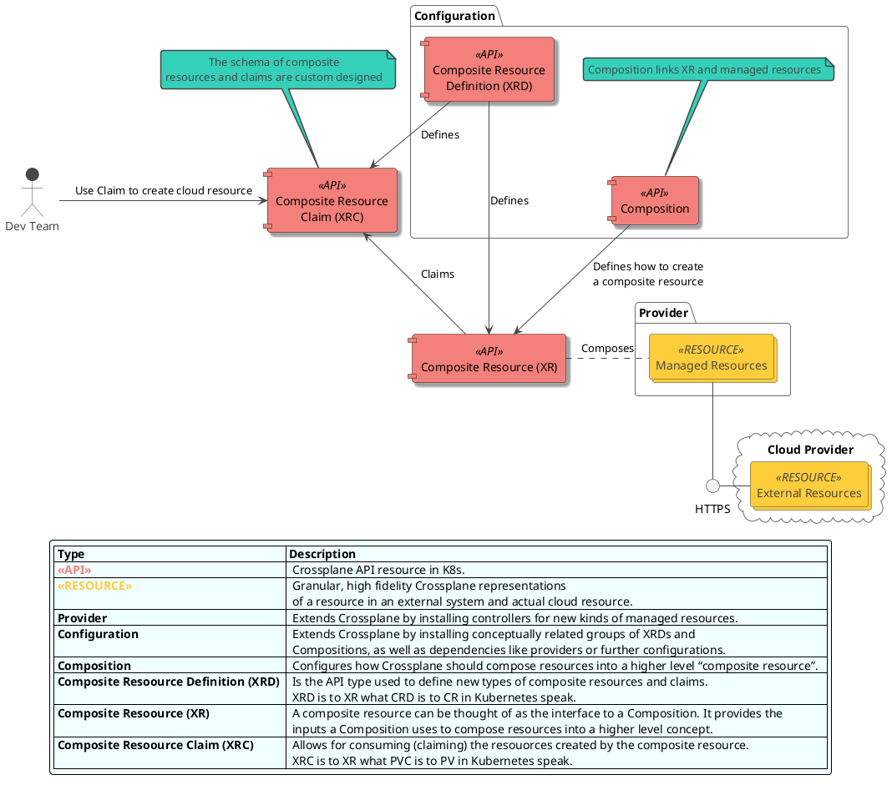
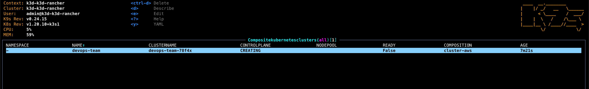

# Crossplane POC

## Introduction Presentation

[Crossplane Slides](https://slides.com/decoder/crossplane)

## Crossplane Architecture

Crossplane is architected to fit K8s resource model.

### Components

Below diagram shows crossplane component model and its basic intetactions.



## Demo Scenario

### Prerequisites

To follow along, you will need subscription to AWS and CLI configured on your local machine.

Credenials for accessing cloud enviroments and deploying the infrastructure will be mapped from mouonted volumes.

Locally installed you will need:

- VS Code with remote contianers devcontainer plugin
- WSL2 if using Windows

### Scenario Description

The demo scenario highlights Crossplane's composite functionality. Using composites helps abstract away infrastructure complexity from developers by moving it into a Platform Team.

The scenario flow:

- explain basic Crossplane concepts and achitecture
- install crossplane on a local cluster :white_check_mark:
- deploy and configure AWS provider :white_check_mark:
- showcase basic functionality by deploying RDS
- showcase more complex functionality by deploying EKS
  - based on EKS example, show how developers can quickly deploy an EKS cluster
- manage composition lifecycle by changing something in the XRC and reapplying to a cluster
- write a very simple composition for EC2 with VPC with port 22 open
- highlight Crossplane benefits, expecially in the context of Platform team

### Demo Setup

All components from the [crossplane installation](https://crossplane.io/docs/v1.5/getting-started/install-configure.html#install-crossplane) are already pre-installed in the devcontainer in this project.

The components are:

- Kubernetes minikube
- Helm
- kubectl
- Crossplane CLI
- AWS CLI

> Crossplane should be installed in a _crossplane-system_ namespace, if not please run `.devcontainer/library-scripts/setup-crossplane.sh`

#### Observability

To visualize CRDs use [Octant](https://docs.vmware.com/en/VMware-vSphere/7.0/vmware-vsphere-with-tanzu/GUID-1AEDB285-C965-473F-8C91-75724200D444.html); a VMWare open source cluster visualizer, running in a browser so no in-cluster installation is required.

If you like terminal tools more, [k9s](https://k9scli.io/) got you covered.

#### AWS provider

The setup will automatically generate AWS configuration based on the default profile mounted from your local $HOME/.aws folder.

> creds.conf file is added to .gitignore so you will not commit it to the repo accidentally!

Next step is to configure Crossplane to access AWS and create resources, we will achieve this by creating a secret:

`kubectl create secret generic aws-creds -n crossplane-system --from-file=creds=./creds.conf`

and now, install AWS provider on the cluster `kubectl apply -f https://raw.githubusercontent.com/crossplane/crossplane/release-1.5/docs/snippets/configure/aws/providerconfig.yaml`

From there onwards you should be able to follow along with the demo from Crossplane's web page.

### Deploy RDS Instance

First let's deploy an RDS Instance, which is an AWS managed resource and comes with the AWS provider.
See [crossplane components diagram](#crossplane-components).

`kubectl create -f rds-instance.yaml`

RDSInstance is just a Kubernetes resource like pod, service or replicaSet. You can check the deployment progress in Octant or command line: `watch kubectl get RDSInstance`

### Deploy EKS Cluster

EKS Cluster deployment status:



#### Retrieve kubeconfig details

```bash
kubectl get secrets --namespace devops-team cluster \
     --output jsonpath="{.data.kubeconfig}" \
     | base64 --decode | tee eks-config.yaml

export KUBECONFIG=$PWD/eks-config.yaml
```

Remember to `unset KUBECONFIG` or source bash/zshrc to get your old config back.

## Conclusion

## TODO
